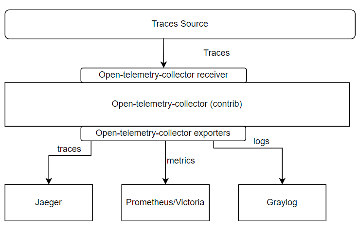
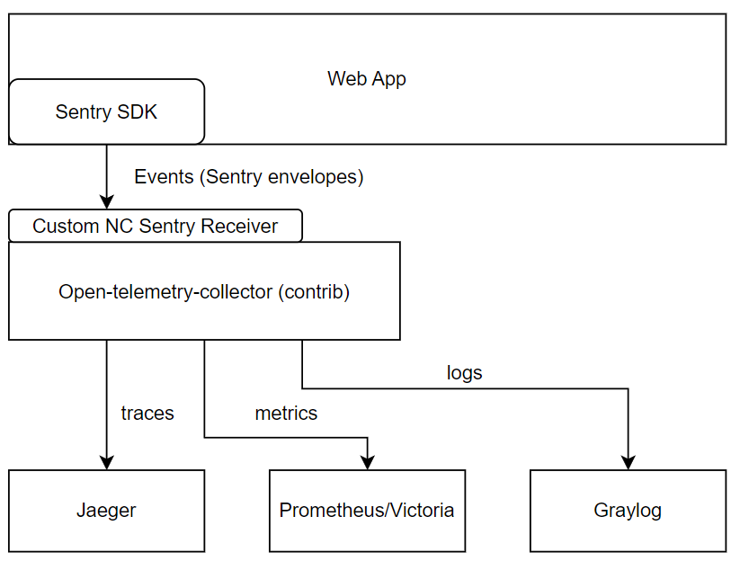

# Open-telemetry-collector

* [Open-telemetry-collector](#open-telemetry-collector)
  * [Introduction](#introduction)
  * [Supported modules](#supported-modules)
  * [Use cases](#use-cases)
    * [Span Metrics Connector](#span-metrics-connector)
      * [Span Metrics Connector Overview](#span-metrics-connector-overview)
      * [ASpan Metrics Connector architecture](#aspan-metrics-connector-architecture)
    * [Sentry Envelopes Processing](#sentry-envelopes-processing)
      * [Sentry Envelopes Processing Overview](#sentry-envelopes-processing-overview)
      * [Sentry Envelopes Processing Architecture](#sentry-envelopes-processing-architecture)
    * [Custom modules configuration](#custom-modules-configuration)
      * [Sentry Receiver](#sentry-receiver)
      * [Sentrymetrics Connector](#sentrymetrics-connector)
      * [Logtcp Exporter](#logtcp-exporter)

## Introduction

The implementation is based on
[open-telemetry/opentelemetry-collector](https://github.com/open-telemetry/opentelemetry-collector)
and
[open-telemetry/opentelemetry-collector-contrib](https://github.com/open-telemetry/opentelemetry-collector-contrib)
versions of open-telemetry-collector.

For more details about open-telemetry approach for processing traces, metrics and logs see
[https://opentelemetry.io/docs](https://opentelemetry.io/docs/)

Open-telemetry-collector approach for configuration see
[https://opentelemetry.io/docs/collector/configuration](https://opentelemetry.io/docs/collector/configuration/)
New modules development approach see
[https://opentelemetry.io/docs/collector/building](https://opentelemetry.io/docs/collector/building/)

## Supported modules

The following third-party modules are supported by this implementation of  open-telemetry-collector:

* [spanmetricsconnector](https://github.com/open-telemetry/opentelemetry-collector-contrib/blob/main/connector/spanmetricsconnector/README.md)
* [debugexporter](https://github.com/open-telemetry/opentelemetry-collector/blob/main/exporter/debugexporter/README.md)
* [otlpexporter](https://github.com/open-telemetry/opentelemetry-collector/blob/main/exporter/otlpexporter/README.md)
* [prometheusexporter](https://github.com/open-telemetry/opentelemetry-collector-contrib/blob/main/exporter/prometheusexporter/README.md)
* [jaegerexporter](https://github.com/open-telemetry/opentelemetry-collector-contrib/tree/v0.85.0/exporter/jaegerexporter)
* [healthcheckextension](https://github.com/open-telemetry/opentelemetry-collector-contrib/blob/main/extension/healthcheckextension/README.md)
* [pprofextension](https://github.com/open-telemetry/opentelemetry-collector-contrib/blob/main/extension/pprofextension/README.md)
* [batchprocessor](https://github.com/open-telemetry/opentelemetry-collector-contrib/blob/main/extension/pprofextension/README.md)
* [filterprocessor](https://github.com/open-telemetry/opentelemetry-collector-contrib/blob/main/processor/filterprocessor/README.md)
* [probabilisticsamplerprocessor](https://github.com/open-telemetry/opentelemetry-collector-contrib/blob/main/processor/probabilisticsamplerprocessor/README.md)
* [transformprocessor](https://github.com/open-telemetry/opentelemetry-collector-contrib/blob/main/processor/transformprocessor/README.md)
* [otlpreceiver](https://github.com/open-telemetry/opentelemetry-collector/blob/main/receiver/otlpreceiver/README.md)
* [jaegerreceiver](https://github.com/open-telemetry/opentelemetry-collector-contrib/blob/main/receiver/jaegerreceiver/README.md)
* [zipkinreceiver](https://github.com/open-telemetry/opentelemetry-collector-contrib/tree/main/receiver/zipkinreceiver)

Also there are custom implementations for

* [sentryreceiver](../receiver/sentryreceiver), see also the [document](sentry-receiver.md#sentry-envelope-mapping-to-jaeger-traces)
* [sentrymetricsconnector](../connector/sentrymetricsconnector), see also the [document](sentry-receiver.md#sentry-envelope-to-metrics)
* [logtcpexporter](../exporter/logtcpexporter), see also the [document](sentry-receiver.md#sentry-envelope-to-logs-records-graylog-mapping)

All third-party and custom modules are listed in [builder-config.yaml](../builder-config.yaml).

## Use cases

### Span Metrics Connector

#### Span Metrics Connector Overview

[Span Metrics Connector](https://github.com/open-telemetry/opentelemetry-collector-contrib/tree/main/connector/spanmetricsconnector):
Aggregates Request, Error and Duration (R.E.D) metrics from span data. Earlier this module was implemented as a
processor, so the module can be named as "Span Metrics Processor".

#### ASpan Metrics Connector architecture

Traces source send traces to [OpenTelemetry Collector](https://opentelemetry.io/docs/collector/).
OpenTelemetry Collector later send traces to Jaeger,
generate metrics for Prometheus and write logs to the Graylog with use of contrib and custom components, see the diagram
below:

### Sentry Envelopes Processing

#### Sentry Envelopes Processing Overview

[Sentry Envelopes Processing](../receiver/sentryreceiver): OTeC receives Sentry envelops via custom receiver,
aggregates Request, Error and Duration (R.E.D) metrics from envelopes data, transforms sentry envelopes
to Jaeger traces and pushes them to Jaeger backend.

#### Sentry Envelopes Processing Architecture

Sentry SDK collects browser events and sends them as Sentry envelopes to custom sentry-receiver of the
open-telemetry-collector-contrib. Custom sentry receiver transforms the received data to the inner
open-telemetry-collector format. Events are aggregated by Custom SentryMetrics Connector. Evaluated metrics are exported
to the :8889/metrics endpoint by contrib Prometheus Exporter. Traces, evaluated on the basis of the events are sent to
the Jaeger, which URL is configured by JAEGER_COLLECTOR_HOST and JAEGER_COLLECTOR_PORT helm parameters via contrib
Jaeger Exporter. Logs, which are also evaluated on the basis of the traces, are sent to the graylog via custom LogTCP
Exporter to the destination, which can be configured in helm via parameters GRAYLOG_COLLECTOR_HOST and
GRAYLOG_COLLECTOR_PORT.

### Custom modules configuration

General approach for the configuration is described
[https://opentelemetry.io/docs/collector/configuration](https://opentelemetry.io/docs/collector/configuration/).
See below the custom modules configuration description.

#### Sentry Receiver

* `endpoint` (`required`) - Contains a string with the port number on which sentry-receiver is listening for input
sentry-envelopes.
* `http-query-param-values-to-attrs` (`optional`) - list of the URLs http query parameters which must be used as
open-telemetry-collector attributes named `http.qparam.<query_parameter_name>.` The value of the attribute is the value
of http query parameter. The URL is taken from sentry envelope by jsonpath "request.url".
* `http-query-param-existence-to-attrs` (`optional`) - list of the URLs http query parameters which must be used as
open-telemetry-collector attributes named `http.qparam.<query_parameter_name>`. The value of the attribute is the `true`,
if the http query parameter exists or `false`, if this parameter doesn't exist. The URL is taken from sentry envelope by
jsonpath "request.url".
* `level-evaluation-strategy` (`optional`) - a string with possible value `breadcrumb`. If the value is `breadcrumb`,
the values from sentry envelope breadcrumbs are taken into consideration during level evaluation. By default, level is
taken from sentry envelope by "level" jsonpath.
* `context-span-attributes-list` (`optional`) - a list of strings, each string is used as a key to the entity inside the
context of the sentry envelop. The sentry envelop context is the map which contains arbitrary data structures, filled in
by the browser application. The entity, which is referred in the list must be a string or a map with a key string and
key-value. If the context entity is a string, this string is put to the value of contexts.<context_name> attribute. If
the context entity is a map with string key and string value, each value of the map is put to the value of
contexts.<context_name>.<map_key> attribute.

#### Sentrymetrics Connector

* `sentry_measurements` (`optional`) - Contains settings for sentry_measurements Prometheus metric
  * `default_buckets` (`optional`) - Contains a list of float values which are defining default buckets for
    the mesurements histograms. For the particular measurement buckets can be overwritten in custom section.
  * `default_labels` (`optional`) - Contains a map, in which a key is the label name and a value is the name of
    the open-telemetry-collector attribute, from which the label value must be taken. For the particular measurement
    the map can be overwritten in custom section.
  * `custom` (`optional`) - Contains a map, in which a key is the measurement name and a value is the data structure
    which contains `buckets` list and `labels` map for this particular measurement. This map allows to overwrite
    the `default_buckets` and `default_labels` settings respectively for the particular measurement.
* `sentry_events` (`optional`) - Contains settings for sentry_events Prometheus metric
  * `labels` (`optional`) - Contains a map, in which a key is the label name and a value is the name of
    the open-telemetry-collector attribute, from which the label value must be taken.

#### Logtcp Exporter

* `endpoint` (`required`) - Contains host and port for the Graylog TCP destination
* `arbitrary-traces-logging` (`optional`) - Contains settings for arbitrary traces logging (ATL).
  ATL allows to log the traces with certain attributes. ATL can work in two modes: span mode and trace mode.
  In the first mode certain attributes of the spans are logging to the graylog. In the second mode the whole
  trace is logged to the graylog.
  * `span-filters` (`optional`) - Contains a list of ATL filters for spans. Spans which satisfy at least one filter
    will be sent to the graylog. Filter consists of 2 conditions and a mapping below:
    * `service-names` - a list of service names. A span must be produced by one of the services in the list
    * `tags` - a map of attributes and values which span must have to be logged. If at least one attribute
      is not matched, the span is not logged.
    * `mapping` - map with string key and list of strings value. The parameter contains a mapping between graylog field
      name and a list of span attributes which must be recorded in the field. Specific naming for graylog fields is
      supported: `__message__`, `__host__`, `__timestamp__`. Specific names for non-attribute data inside spans are also
      supported: `__spanId__`, `__traceId__`, `__name__`, `__end_timestamp__`, `__start_timestamp__`, `__kind__`,
      `__parentSpanId__`, `__startTime__`, `__endTime__`.
  * `trace-filters` (`optional`) - Contains a list of ATL filters for traces. Trace which satisfy at least one filter
    will be sent to the graylog. Filter consists of two conditions below.
    * `service-names` - a list of service names. A trace must be produced by one of the services in the list
    * `tags` - a map of attributes and values which trace must have to be logged. If at least one attribute
      is not matched, the trace is not logged.
* `connection-pool-size` (`optional`) - Connection pool size for the graylog. Default value is 1.
* `queue-size` (`optional`) - Size of the queue of messages before sending them to the graylog.
* `max-message-send-retry-count` (`optional`) - message is skipped after this number of retries to send it
  to the graylog. Default value is 1.
* `max-successive-send-error-count` (`optional`) - the number of successive send errors to the graylog after
  which open-telemetry-collector stops sending messages to the graylog for a `successive-send-error-freeze-time`
  time period. Default value is 5.
* `successive-send-error-freeze-time` (`optional`) - The time period for which open-telemetry-collector
  stops sending messages to the graylog after `max-successive-send-error-count` successive send errors to the graylog.
  The time period is set in Go duration format. Default value is "1m" - 1 minute.
